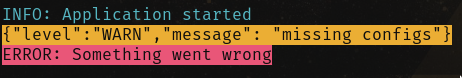

# cloggo

Command line tool for visualizing logs in the terminal to help you debug your application by easily identifying the important parts of the log.

## Format

| Level | Color | Background |
| ----- | ----- | ---------- |
| INFO  | Cyan  | Black      |
| WARN  | Black | Yellow     |
| ERROR | Black | Red        |

## Installation

```bash
go install github.com/karim-w/cloggo@latest
```

## Usage

```bash
{process} | cloggo
```

## Example

```bash
$ echo '
INFO: Application started
{"level":"WARN","message": "missing configs"}
ERROR: Something went wrong
' | cloggo
```



## License

BSD 3-Clause License

## Author

Karim-W

## Contributing

Pull requests are welcome. For major changes, please open an issue first to discuss what you would like to change.
